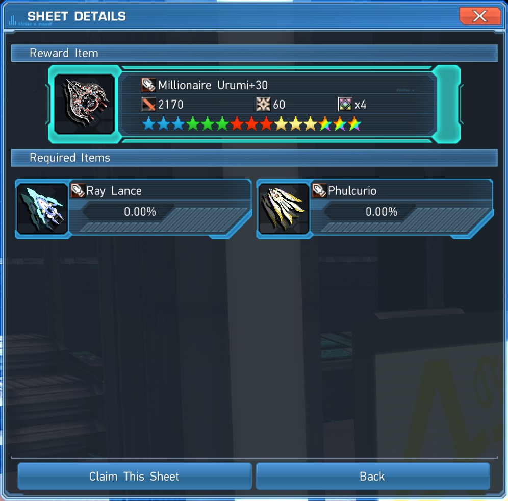

## Phantasy Star Online 2 Resource Guide
A quick list of ways to maximize your return of valuable resources in PSO2!

Inventory filling up? Check this before you sell your unused items!
Many of these topics are much deeper than covered here, this guide serves only as a heads up before you go and trash something worth more than it seems.

Legend: 
* denotes the star rarity of something.

## Mags:
Feed them right to get the highest boost.

- Look up what kind of Mag you want for your class build, most of the time you want a pure single stat Mag. If you just feed your Mag random items, it will level up multiple stats. Instead, feed it furnishings periodically to decease unwanted stats before they level up.

- https://pso.fandom.com/wiki/Mag#Food_items

That chart can help you find what items will best help decrease stats. I will also quickly list the basic strategies:
- S-ATK Mag: Feed Striking Weapons (Red Ones) + 4* Furnishings
- R-ATK Mag: Feed Ranged Weapon (Blue Ones) + 5* Furnishings
- T-ATK Mag: Feed Technique Weapons (Yellow Ones) + 6* Furnishings
- DEX: Discs

- Furnishings can be bought from the NPC in the shopping center near the recycle shop.

## Weapon and Unit drops: 
You’ll get a lot of them, the need to off load them is a critical part of this game. But what to do?

- Weapons and units of 10* can be exchanged at the Swap Shop. Units 5 per 1 Photon Sphere, weapons 1 per 1 Ex-Cube.

- Weapons and Units of 11* or above can  and often should be dismantled in your personal quarters for materials you can use at the Zig NPC to get end game weapons and units (with other prerequisites).
-  https://pso2na.arks-visiphone.com/wiki/Crafting_Materials
- Less than 11* can also be broken down, but they yield steel grade materials and will only yield secondary type (the kind named after gemstones) on a great success.
- Lower grade materials can be exchanged at the Swap Shop for higher grade materials, excepting the highest platinum grade primary type and emerald and diamond grade secondary type.

# You’ll want to keep certain Affixes: 
- Things like Modulator, Crack, Glares, Veterans Resolve, level III or above on ~4 slot (average, not a rule) units on the relevant stat increase, multiple copies of a good soul for your build, Fabula soul (for increasing success of reveries), Mutation II (for increasing success of basic stat boosts), Doom Break, stat IV on weapons (you can also save stat III but this will drop a lot no need to over hoard), multiple copies of a good reverie, etc.
- https://pso2na.arks-visiphone.com/wiki/List_of_Augments
- Affixing is a complex subject and I will say not not immediately stress about it, at some point you may feel like planning out your affixes, then you will know what to keep.
- https://arks-layer.com/abilitysim/na/ 
- https://corvous.github.io/PSO2AffixingAssistant/
- These simulators are a great way to help you drill down on exactly what needs to come together for a certain affix list. Do note however that the PSO2 Affixing Assistant uses all 6 fodder by default, this can be an expensive (in terms of Meseta) habit to get into.

## Discs:
- Discs over level 11 can be dismantled, in your personal quarters, into Fragment materials required to craft PA Customization, customized PAs can be stronger and in certain builds better suited to what you want to do. The materials also take up less space and if noting else, are easier to sell on the market if you ever do so.

## Create Additional Characters:
Characters on the same ship can freely exchange items through default storage.

• This can be used to augment your storage as well as multiply the amount of rewards for daily missions and recommended quests you can receive, including Bonus Mission Keys, Triboosts, and Lambda Grinders.

## Collection Sheets:
Make sure to Grab some Collection Sheets and be running them all times, it's free and rewards you with powerful weapons. 

• You can use them as a stopgap.
• Upgrade them at Zig.
• Dismantle them for crafting materials to upgrade other weapons at Zig.
• Use the ones that come +30 as the most economical way (in both Meseta and Lambda Grinders) to Enhance 13* or above weapons.
