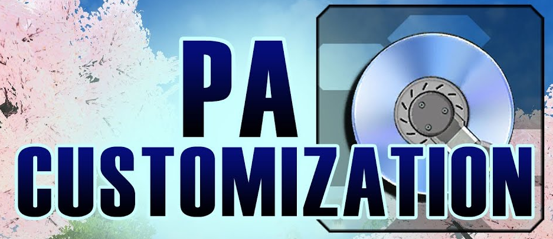

# Phantasy Star Online 2 Basic Resource Guide
A quick list of ways to maximize your return of valuable resources in PSO2!

Inventory filling up? Check this before you sell your unused items!
Many of these topics are much deeper than covered here, this guide serves only as a heads up before you go and trash something worth more than it seems.

There is a [Glossary](#Glossary) describing the some of the valuable items mentioned herein, if not otherwise linked to a relevant page.

Legend: 
- \* denotes the star rarity of something.

## Mission Pass Season 11 Urgent Notice:
This current season of the Mission Pass rewards you with a Key Rivalate at level 30, a necessary item for obtaining end game Rivalate Weapons from Zig. Don't miss out!

## Missions and Mission Pass:
The game might tutorialize this for you, but make no mistake, the rewards found here are quite valuable. 
- Don't undersell the value of the single star rewards from doing Weekly and Daily Missions.
- You can defer claiming your rewards for items that expire, if they would otherwise expire before an advantageous time for using them. Don’t forget to actually claim them before the claim period itself expires.
- Strive to collect the Triboost, Affix Success Boost, [Lambda Grinder](#Glossary), and [Bonus Key](#Bonus-Keys) rewards.

## Mags:

Feed them right to get the highest boost.

- Look up what kind of Mag you want for your class build, most of the time you want a pure single stat Mag. If you just feed your Mag random items, it will level up multiple stats. Instead, feed it furnishings periodically to decease unwanted stats before they level up.

- [Mag Food](https://pso.fandom.com/wiki/Mag#Food_items)

- That chart can help you find what items will best help decrease stats. I will also quickly list the basic strategies:
  - S-ATK Mag: Feed Striking Weapons (Red Ones) + 4* Furnishings + Monomates
  - R-ATK Mag: Feed Ranged Weapon (Blue Ones) + 5* Furnishings + Dimates
  - T-ATK Mag: Feed Technique Weapons (Yellow Ones) + 6* Furnishings + Trimates
  - DEX: Discs

- Furnishings can be bought from the NPC in the shopping center near the recycle shop, pictured later.

## Weapon and Unit Drops:

You’ll get a lot of them, the need to off load them is a critical part of this game. But what to do?

- Weapons and units of 10* can be exchanged at the Swap Shop. Units 5 per 1 [Photon Sphere](#Glossary), weapons 1 per 1 [EX-Cube](#Glossary) or 30 [Grinders](#Glossary). Usually, EX-Cubes are preferable.
- Weapons of 12* can be exchanged at the Swap Shop for Lambda Grinders.

- Weapons and Units of 11* or above can and often should be dismantled in your personal quarters for materials you can use at the [Zig NPC](https://pso2na.arks-visiphone.com/wiki/Zig_Permit_Exchange_Shop) to get end game weapons and units (with other prerequisites).
- [Dismantling Materials](https://pso2na.arks-visiphone.com/wiki/Crafting_Materials)
- Less than 11* can also be broken down, but they yield steel grade or lower materials and will only yield secondary type (the kind named with gemstone prefixes for weapons, neo or prometheus prefix for units) on a great success.
- Lower grade materials can be exchanged at the Swap Shop for higher grade materials, excepting the highest platinum grade primary type and emerald and diamond grade secondary type.

**You’ll want to keep certain Affixes:**
- Things like Modulator, Crack, Glares, Veterans Resolve, level III or above on ~4 slot (average, not a rule) units on your relevant stat increase, multiple copies of a good soul for your build, Fabula soul (for increasing success of reveries), Mutation II (for increasing success of basic stat boosts), Doom Break, stat IV on weapons (you can also save stat III but this will drop a lot, there no need to over hoard them), multiple copies of a good reverie, etc.
- [List of Augments](https://pso2na.arks-visiphone.com/wiki/List_of_Augments)
- Affixing is a complex subject and I will say not not immediately stress about it, at some point you may feel like planning out your affixes, then you will know what to keep.
- [ARKS Layer AbilitySim](https://arks-layer.com/abilitysim/na/)
- [PSO2 Affixing Assistant](https://corvous.github.io/PSO2AffixingAssistant/)
- These simulators are a great way to help you drill down on exactly what needs to come together for a certain affix list. Do note however that the PSO2 Affixing Assistant uses all 6 fodder by default, this can be an expensive (in terms of Meseta) habit to get into.

## Discs:

- Discs over level 11 can be dismantled, in your personal quarters, into Fragment materials required to craft [PA](https://pso2na.arks-visiphone.com/wiki/Photon_Art_Customs_List) and [Technique](https://pso2na.arks-visiphone.com/wiki/Technique_Customs_List) Customizations, customized PAs/Techs can be stronger and in certain builds better suited to what you want to do. The materials also take up less space and if nothing else, are easier to sell on the market if you ever choose to do so.

## Create Additional Characters:

Characters on the same ship can freely exchange items through default storage, and share many other perks like titles.

- This can be used to augment your storage as well as multiply the amount of rewards for daily and weekly missions and recommended quests you can receive.
- They also contribute stars to the same Mission Pass, this is both a positive and negative. On one hand, an easier pass level up process; on the other hand, no duplicating Mission pass rewards.

## Collection Sheets:

Make sure to Grab some Collection Sheets and be running them at all times. It's free and rewards you with powerful weapons. 

- The NPC that hands these out is in the front desk in the Gate Area, next to the Quest Counter.
- You can equip them as a stopgap.
- Some of them can be upgraded at Zig.
- Dismantle them for crafting materials to upgrade other weapons at Zig.
- Use the ones that come +30 as the most economical way (in both Meseta and Lambda Grinders) to Enhance 13* or above weapons.

## Quest Triggers:
Quest Triggers are special consumable items you can use to get a one-time on-demand entry to special quests, usually past Urgent Quests. These are hard to come by so don't do them arbitrarily!

 - Wait until you can do them at the highest difficulty available.
 - Try to bring a full party or multi party for increased rewards and more ensured victory, if you have an alliance ask those people. Alliances will sometimes run trigger parties.
 - Plan to use boosters and if possible use these triggers on boosted days as well, especially if the quest has rare drops you could use. 

## Bonus Keys:
Bonus Keys give a good chunk of EXP, and some decent to great drops depending on the type.

- Bonus Keys expire, make sure to check the date.
- That said, expired keys (and non expired) keys can be exchanged for a Tokyo Gold Key in the Swap Shop, any 5 keys for 1 Gold. For reference, one run of Tokyo Gold run is worth slightly less than 4 runs of Tokyo Silver.
- Unless, that is, in the example of the PSO2 Day EXP boost. On a normal day, it would take at least 275% EXP boost from other sources while using 5 Tokyo Silver Keys to yield more EXP than what the **same amount of boosters** used on PSO2 Day (so, consumed EXP Boost + PSO2 Day Boost) would yield on PSO2 Day using 1 Tokyo Gold Key. To be clear, using the boosters + PSO2 Day Boost for Silver Keys is still better, but for keys that expire **before** PSO2 Day or other free boost periods, you may find it advantageous to just recycle into Gold Keys.
- ‘Recommended’ Quests can give keys, among other good items, and reset daily.

## NPC Shops:
There are several NPC shops you might not have looked at.

#### Badge Shop Area:

Here you will find the shops for exchanging [Badges](https://pso2na.arks-visiphone.com/wiki/Unique_Weapons_Badge_Shop), [Photon Drops/Spheres/Boosters](https://pso2na.arks-visiphone.com/wiki/Photon_Drop_Exchange_Shop), [Astracite](https://pso2na.arks-visiphone.com/wiki/Astracite_Exchange_Shop), [EX-Cubes](https://pso2na.arks-visiphone.com/wiki/EX-Cube_Shop), [Buster Medals](https://pso2na.arks-visiphone.com/wiki/Buster_Medal_Shop), and [Battle Coins](https://pso2na.arks-visiphone.com/wiki/Battle_Coin_Barterer). 

- Here you can get units, weapons, consumables, boosters, and resources, among a few other things.
- Be careful what you spend. They offer a lot of weapons but a lot are dead ends.
- Some have useful [Augment Factors](https://pso2na.arks-visiphone.com/wiki/Augment_Factors), some can be upgraded at Zig. Do also note Photon Spheres are also needed to unlock a weapon’s Potential when Enhancing.
- You can exchange Astracite for Photon Boosters instead of Photon Spheres, this can be cheaper than Spheres depending on the type of Astracite you use. Some types of Astracite, such as Ares Phantacite,  are much more rare and used in other places such as Zig. Check the Astracite Shop page.

#### Swap Shop Area:

Here you will find the shops to buy basic Furnishings, spend FUN points, exchange Challenge Miles, and most importantly an extended [Swap Shop](https://pso2na.arks-visiphone.com/wiki/Swap_Shop_2) that has many more options than the Swap Shop you can access from the AC Menu. 

- This version of the Swap Shop is where you can exchange Mission Badges and convert lower grade item dismantling materials into higher grade ones, as mentioned previously.
- The Furnishing shop here is where you can buy Furnishings to help level your Mag mas described previously.

## Gathering:
- [List of Gathering Resources](https://pso2na.arks-visiphone.com/wiki/Gathering)
- Harvesting yields resources necessary to obtain and Enhance rings, and ingredients for the culinary shop.
- Fishing yields ingredients for the culinary shop.
- Dishes from the culinary shop can be used to fulfill the ‘Use Food or Booster’ Daily Missions.
- Food can also be used to boost the gathering rate for certain kinds of items. For instance, Sashimi requires only one Ruins Salmon and will help you gather “Rocks” for rings.
- The best Food to make depends on the overlap with what you will be getting while looking for rocks and gems for rings.
- Check Yerkes for any extra items you can pawn off to him for Meseta.
- Remember each character has its own gathering stamina bar.
- Try to stack food boosts and Gathering Fever.
- You can build up fever by fishing before you harvest, in the same area at least.

## Rings:
Obtained from a NPC inside Franca’s Cafe, the most relevant point to mention is to go ahead and find out what rings are best for your class build and start earning EXP on them.

- L Rings at +20 can be put on 12* or higher units, allowing you to use multiple of them.

## Glossary:

- EX-Cubes are a merit currency. They are used in places like the EX-Cube Shop and The Zig NPC.
- Grinders are a consumable resource used for [Enhancement](https://pso2na.arks-visiphone.com/wiki/Enhancement). They are relatively cheap.
- Lambda Grinders are the same as above, but used for 13* and greater weapons and rings over a certain level, ring depending. Unlike regular Grinders, the Lambda variety are not cheap.
-  Photon Spheres are another currency. They are used in places like the Photon Shop and for unlocking weapon Potentials mid way through Enhancing.

### Need To Add:

 - Summoner Advice (Eggs and Candy are alien to me).
