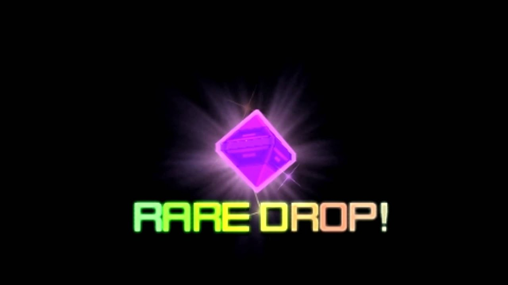

# Phantasy Star Online 2 Basic Resource Guide
A quick list of ways to maximize your return of valuable resources in PSO2!

Inventory filling up? Check this before you sell your unused items!
Many of these topics are much deeper than covered here, this guide serves only as a heads up before you go and trash something worth more than it seems and as a baseline for getting more out of your time going forward.

There is a [Glossary](#glossary) describing the some of the valuable items mentioned herein, if not otherwise linked to a relevant page or section.

Legend: 
- A \* after a number denotes the star rarity of something.

## Sega Campaigns:
Sega regularly awards you for doing relatively simple tasks.
- [Campaign Announcements](https://pso2.com/news/announcements)
- Always pay attention to these. Seriously.

#### Super Campaign Urgent Notice Until 2/16:
- Sega is currently running campaigns for free end game gear; just for doing 5 Recommended Quests and receiving the gift, and 9 runs of the current Limited Quest. Get out there!

## Missions and Mission Pass:
The game might tutorialize this for you, but make no mistake, the rewards found here are quite valuable. 
- Don't undersell the value of the single Mission Pass Star rewards from doing Weekly and Daily Missions.
- You can defer claiming your rewards for items that expire, if they would otherwise expire before an advantageous time for using them such as [PSO2 Day](#pso2-day). Don’t forget to actually claim them before the claim period itself expires.
- Strive to collect the [Triboost](#consumable-boosts), Affix Success Boost, [Lambda Grinder](#glossary), and [Bonus Key](#bonus-keys) rewards.
- The Gold tier of the Mission Pass costs 200 SG to unlock on its own, but it will sometimes reward SG tickets, offsetting the cost.
- Unless you have a habit of buying cosmetics from the Fresh Finds Shop, the periodic free SG rewards from various sources should have you able to pay for the Gold tier many months out of the year.
- The Gold tier sometimes rewards Class EX-Cubes. These can be an easy way to get most of your monthly allotment of [Affix Transfer Passes](#affix-transfer-passes), even when you don’t have high level classes to run.

## Recommended Quests:
Four to run each day, each gives a gift.

- The gifts are not per character.
- Gifts include Badges, Eggs, consumable boosts, and Bonus Keys.
- Running one on each character is an easy way to also complete your Daily Mission for “Clear an Expedition, ARKS, Limited Time Quest”.
- Accepting one at the last minute before the day rolls over and the Quests reset, will still award the gift if you complete it after the date change. Avoid doing this on the kind that can be failed (looking at you, Lillipan Rescue).
- The 4th Recommended is unique. It is only available as a Recommended and has an innate EXP boost applied to it. These are both “Collect Quest Points” type with mobs and bosses, and boss rush type with only bosses.

## Bonus Keys:
Bonus Keys give a good chunk of EXP, and some decent to great drops depending on the type.

- Bonus Keys expire, make sure to check the date.
- That said, expired keys (and some non expired) keys can be exchanged for a Tokyo Gold Key in the Swap Shop. Any 5 keys for 1 Gold.
- For reference, one run of Tokyo Gold is worth slightly less than 4 runs of Tokyo Silver.
- Unless, that is, in the example of the PSO2 Day EXP boost. On a normal day, it would take at least 275% EXP boost from other sources while using 5 Tokyo Silver Keys to yield more EXP than what the **same amount of boosters** used on PSO2 Day (so, consumed EXP Boost + other incidental boost + PSO2 Day Boost) would yield on PSO2 Day using 1 Tokyo Gold Key. To be clear, using the boosters + PSO2 Day Boost for Silver Keys is still better, but for keys that expire **before** PSO2 Day or other free boost periods, you may find it advantageous to just recycle into Gold Keys.
- Magatsu keys give less EXP, but also rewards Star Gems. Never let these expire, but don't stress doing them during boost periods.
- Bonus Keys should be run with a Sub-Class under the level limit for earning EXP on the Sub-Class whenever possible. Exceptions to this are of course Scion main classes, but also Rainbow Keys.
- Tokyo Rainbow runs can give valuable enough drops and rewards such that, S Ranking them may be more important than running them on classes that might need the EXP more.

## Quest Triggers:
Quest Triggers are special consumable items you can use to get a one-time on-demand entry to special quests, usually past Urgent Quests. These are hard to come by so don't do them arbitrarily!

 - Wait until you can do them at the highest difficulty available.
 - Try to bring a full group for increased rewards and more ensured victory, if you have an alliance ask those people. Alliances will sometimes run trigger parties.
 - Plan to use extra boosters and if possible use these Triggers on boosted days as well, especially if the Quest has rare drops you could use.
 - You can join the group of another player’s Trigger Quest by selecting “Join Party with Quest in Progress” from the Quest Counter. Triggers will be prefixed with “T:”.
 - High population blocks like block 1 often run Triggers all day.

## Incidental Boosts:
Always run content with the highest % boost economical.

#### Drink Boosts:
- The drinks you can get from the medical terminal also have a chance to award certain boosts like EXP, Meseta, or rare drop.
- [Drink Menu](https://pso2na.arks-visiphone.com/wiki/Drink_Menu)
- Shifta is EXP, Guts is Meseta, Deband is rare drop. Deband also has a separate special effect up, which increases Affix drops.
- You can pre-load a drink before an Urgent Quest at the NPC inside the Gate area, across from the Class Counter. While doing multi-stage Urgents, check to see using "Character Info" in your menu, if the drink expired. On some Urgents, it doesn't and you can keep the same boost throughout the entire process.
- You can also use drinks to pause your consumable item boosts. Good for when you have time left after high reward content but need to do low reward content in the meantime. The checkbox for this is at the top of the menu, above the drink list.

#### Alliance Boosts:
- Inside your Alliance Quarters there is a tree, use it to receive two hours worth of boost.
- The timer is the kind that always goes down, not just while in a quest.
- Usually you want EXP or rare drop, but Meseta can be useful and ATK can help you beat harder content like solo Urgent bosses, especially when combined with an ATK "Shifta" drink or Health "Guts" drink.
- These are otherwise unlimited.

#### Daily Boost:
- You can get up to 50% Triboost for doing the Daily Orders with the arrow at the end of their name. 
- It's 5% per Order, but once you hit 50%, it's only one Order per 24 hours to maintain it.
- The boost Orders are always correlated with the same Quest as the first Recommended Quest.

#### Talisman Boost:
- Zig's client orders can award two Talismans.
- Zig can be found in the Shopping Plaza, to the right of the center stage when facing towards the Casino hallway.
- One, called Augmentalist, gives an Affix drop rate bonus; making high slot items with better Affixes easier to find. Always run this one, it's invaluable.
- The other, called Good Fortune, converts all of your rare drops into “?” unappraised items. While this can allow you to choose "Enhanced Appraisal" on even more items if you wish, it will drain your Meseta always running this or reduce your 10* weapons if you do not appraise, and therefore your [swapped](#weapon-and-unit-drops) Ex-Cubes and Photon Spheres.
- The weapons you need are Nyoibo for Augmentalist and Vraolet for Good Fortune. You must Enhance these to +30 first and then present them to Zig. This does not consume the weapon, and you can use the same weapon to complete it on all your characters. Both weapons are available in the EX-Cube shop.
- You must have the weapon in your inventory, but no longer require equipping it, for the boost to work.

#### Consumable Boosts:
- I'm sure I don't have to tell you about boost items, but remember, if you run 3 characters and always do your Daily Missions, you will have more Triboosts than you can sneeze at. If you "save them for later", soon you will have >100 and could run them non stop for weeks.
- A good rule of thumb is to always run at least a Triboost 50%, an EXP 75%, and a Rare Drop 250% for all Urgent Quests and other high level, high reward content.
- Rare Drop 250% can be bought for 6 EX-Cubes at the [EX-Cube Shop](#badge-shop-area), and EXP 75% for 1 Photon Sphere at the Photon Drop Shop.
- Don't worry about the expense, you will have more EX-Cubes and Photon Spheres than you will know what to do with if you make a habit of always Swap Shopping for them as described later.
- Save your Meseta Boost consumables for Rainbow Bonus Keys. The Mesetans at the end drop a lot of Meseta, as you might guess.

#### Urgent Quest Participation Boosts:
- Certain Urgent Quests can reward certain boosts like rare drop rate or Enhancement success % boost for partaking in them.
- This boost is the same as an Alliance boost in that the timer goes down at all times after being applied.

#### PSO2 Day:
The ~2nd of every month for free users.
- Just logging in on this day rewards you with SG Tickets.
- All Quests will have an innate EXP and rare drop rate boost applied during this period.
- Save Bonus Keys to farm during this time.
- Check your time zone to see when this starts for you, many NA users will find this starts some time the previous night on the 1st.

#### Concerts:
Periodically you may hear an announcement ‘A Live Concert will be held in the Shopping Plaza’.
- Watching the concert, specifically being present for the end, will apply a boost to the character that was present.
- This boost is the same as an Alliance boost in that the timer goes down at all times after being applied.

## Weapon and Unit Drops:

You’ll get a lot of them, the need to off load them is a critical part of this game. But what to do?

- Weapons and units of 10* can be exchanged at the Swap Shop. Units 5 per 1 [Photon Sphere](#glossary), weapons 1 per 1 [EX-Cube](#glossary), 1 Photon Sphere, or 30 [Grinders](#glossary). Usually, EX-Cubes or Photon Spheres are preferable for weapon swaps.
- Weapons of 12* can be exchanged at the Swap Shop for Lambda Grinders.
- The basic Swap Shop can be accessed from your menu, under the icon with a shopping cart.
- Weapons and Units of 11* or above can and often should be dismantled in your Personal Quarters for materials you can use at the [Zig NPC](https://pso2na.arks-visiphone.com/wiki/Zig_Permit_Exchange_Shop) to get end game weapons and units (with other prerequisites).
- [Dismantling Materials](https://pso2na.arks-visiphone.com/wiki/Crafting_Materials)
- Less than 11* can also be broken down, but they yield steel grade or lower materials and will only yield secondary type (the kind named with gemstone prefixes for weapons, neo or prometheus prefix for units) on a great success.
- Lower grade materials can be exchanged at the Swap Shop for higher grade materials, excepting the highest platinum grade primary type and emerald and diamond grade secondary type.
- Even 10* units dismantled into steel grade materials does eventually yield a usable collection of gold grade materials by using the [Craft Swap Shop](#swap-shop-area). This might be worth doing since you will get unit materials much slower than weapon materials.

**You’ll want to keep certain Affixes:**
- Things like Modulator, Sentence Triple, Crack, Glares, Veterans Resolve, level III or above on ~4 slot (average, not a rule) units on your relevant stat increase, multiple copies of a good soul for your build, Fabula/Historia soul (for increasing success of reveries), Mutation II (for increasing success of basic stat boosts), Doom Break, stat IV on weapons (you can also save stat III but this will drop a lot, there no need to over hoard them), multiple copies of a good Reverie, etc.
- [List of Augments](https://pso2na.arks-visiphone.com/wiki/List_of_Augments)
- S Grade Augments have a special icon and are *extra* valuable. These are easily transferred differently from regular Affixes and are rarer.
- Make sure to also check higher rarity weapons' and units' [Augment Factors](https://pso2na.arks-visiphone.com/wiki/Augment_Factors). You can do this by selecting the item and "Check Augment Factor". Augment Factors are *extra* valuable because they are a 100% base success rate, at the cost of Enhancing them item to +35. This can yield **easy** 6/7/8s for weapons if you're clever.
- Affixing is a complex subject and I will say not not immediately stress about it, at some point you may feel like planning out your Affixes, then you will know what to keep.
- [ARKS Layer AbilitySim](https://arks-layer.com/abilitysim/na/)
- [PSO2 Affixing Assistant](https://corvous.github.io/PSO2AffixingAssistant/)
- These simulators are a great way to help you drill down on exactly what needs to come together for a certain Affix list. Do note however that the PSO2 Affixing Assistant uses all 6 fodder by default, this can be an expensive (in terms of Meseta) habit to get into.
- When planning a large Affix, consider waiting for an Affix success % boost + free Meseta Affix campaign to roll around. Sega has been generous with these lately on NA, we had one both in November 2020 and February 2021.

## Affix Transfer Passes:
These let you *transfer* Affixes from one item to another, with no random success chance.

- They are limited to **40** a month, and cost 2 Class EX-Cubes each. 10 passes for each group of classes, Hu/Ra/Fo the standard, Fi/Gu/Te the specialized, Br/Bo/Su the hybrids, and Hr/Ph/Et the Scions.
- Hence, make sure to buy as many as possible every month and save them up, even if you aren't planing an Affix in the foreseeable future. Some day you will need a lot of them.
- These can be used, along with an add Affix consumable, to basically upslot a weapon for 'free', at least in terms of not incurring an Affix success penalty.
- [Getting the most out of your Ability Transfer Passes](https://www.reddit.com/r/PSO2/comments/fw3nqj/getting_the_most_out_of_your_ability_transfer/)
- These are better used on units if you ask me, since units have a much reduced selection of Augment Factors and much more expensive fodder. When used with a 13* unit's respective S Grade Augment and an add Affix consumable, that's two free upslots.

## Discs:

Discs over level 11 can be dismantled, in your personal quarters, into Fragment materials required to craft [PA](https://pso2na.arks-visiphone.com/wiki/Photon_Art_Customs_List) and [Technique](https://pso2na.arks-visiphone.com/wiki/Technique_Customs_List) Customizations.

- Customized PAs/Techs can be stronger and in certain builds better suited to what you want to do.
- The Fragments also take up less space and if nothing else, are easier to sell on the market if you ever choose to do so.
- Junk PA/Tech Customization Discs, ergo ones that roll with bad modifiers, are worth extra EXP when fed to a DEX Mag.

## Create Additional Characters:

Up to three characters can be made for free. Even if you do just the minimum on your 2nd and 3rd, embezzling the rewards on to main is very valuable.

- This will multiply the amount of rewards for daily and weekly Missions, *some* main Missions, Client Orders, Bingo Cards, Seasonal Orders, and Yerkes payouts; as these are per character.
- Some Visophone Campaign rewards are per-character, these are rare but usually very good like full Skill Tree Reset Tickets.
- Characters on the same ship can freely exchange items through default storage.
- They share the same Title list and Title stat boosts.
- They also contribute stars to the same Mission Pass. Tier, daily, and weekly Missions will award the stars only to the first completion.
- Collection Sheets are shared.

## Class Title Stat Boosts:
Each non-Scion Class you raise to level 75 on any character gives you a Title that raises certain stats on all of your classes, on all of your characters.

- [Class Boosts](https://www.bumped.org/psublog/pso2-class-boost/)
- Some class combos will need both the Braver and Bouncer boosts to DEX to be able to equip end-game DEX requirement gear, at least at level 95/95. 100/100 may make this irrelevant. (Imagine my ire at my Gu/Fi not being able to equip Rivalate Units).
- You’d be surprised how quickly you can raise a class you don't even plan on using to 75 just by running them as sub-class during Bonus Keys. I raised 4 classes to 75 from 1 in one PSO2 day.

## Mags:

Feed them right to get the highest stat boost.

- Look up what kind of Mag you want for your class build, most of the time you want a pure single stat Mag. If you just feed your Mag random items, it will level up multiple stats. Instead, feed it furnishings or -mates periodically to decease unwanted stats before they level up.
- [Mag Food](https://pso.fandom.com/wiki/Mag#Food_items)
- That chart can help you find what items will best help decrease stats. I will also quickly list the basic strategies:
  - S-ATK Mag: Feed Striking Weapons (Red Ones) + 4* Furnishings + Monomates
  - R-ATK Mag: Feed Ranged Weapon (Blue Ones) + 5* Furnishings + Dimates
  - T-ATK Mag: Feed Technique Weapons (Yellow Ones) + 6* Furnishings + Trimates
  - DEX: Discs
  
- Furnishings can be bought from the NPC in the Shopping Plaza near the Swap Shop, pictured later.
- DEX and R-ATK have it the easiest, T-ATK and S-ATK are harder and will need to rely more on -mates.
- You can purchase an item for leveling down 1-lvl, and zeroing out the EXP bar, of a single Mag stat at the Ex-Cube Shop.
- It is cheaper in AC to buy a new Mag than buying the AC full Mag reset item.

## NPC Shops:
There are several NPC shops you might not have looked at.

#### Badge Shop Area:

Here you will find the shops for exchanging [Badges](https://pso2na.arks-visiphone.com/wiki/Unique_Weapons_Badge_Shop), [Photon Drops/Spheres/Boosters](https://pso2na.arks-visiphone.com/wiki/Photon_Drop_Exchange_Shop), [Astracite](https://pso2na.arks-visiphone.com/wiki/Astracite_Exchange_Shop), [EX-Cubes](https://pso2na.arks-visiphone.com/wiki/EX-Cube_Shop), [Buster Medals](https://pso2na.arks-visiphone.com/wiki/Buster_Medal_Shop), and [Battle Coins](https://pso2na.arks-visiphone.com/wiki/Battle_Coin_Barterer). 

- Here you can get units, weapons, consumables, boosters, almost every single level 17 Disc, and resources, among a few other things.
- Be careful what you spend. They offer a lot of weapons but a lot are dead ends.
- Some have useful [Augment Factors](https://pso2na.arks-visiphone.com/wiki/Augment_Factors), some can be upgraded at Zig.
- Do also note Photon Spheres are also needed to unlock a weapon’s Potential when Enhancing.
- You can exchange Astracite for Photon Boosters instead of Photon Spheres, this can be cheaper than Spheres depending on the type of Astracite you use. Some types of Astracite, such as Ares Phantacite,  are much more rare and used in other places such as Zig. Check the Astracite Shop page.

#### Swap Shop Area:

Here you will find the shops to buy basic Furnishings, spend FUN points, exchange Challenge Miles, and most importantly an extended [Swap Shop](https://pso2na.arks-visiphone.com/wiki/Swap_Shop_2) that has many more options than the Swap Shop you can access from the AC Menu. 

- This version of the Swap Shop is where you can exchange Mission Badges, get Affix Transfer Passes, and convert lower grade item dismantling materials into higher grade ones, as mentioned previously.
- The Furnishing shop here is where you can buy Furnishings to help level your Mag mas described previously.
- Here you can use the Limited Swap Shop, these items have a max you can get a month.

## Collection Sheets:

Make sure to grab some Collection Sheets and be running them at all times. It's free and rewards you with rare weapons. 

- The NPC that hands these out is in the front desk in the Gate area, next to the east side Quest Counter when facing the Gateway Ship.
- You can equip them as a stopgap. The Croesus series has a *crazy* low equip requirement (DEX, on par with 6* weapons) considering they are 15*.
- Some of them can be upgraded at Zig.
- Dismantle them for materials to upgrade other weapons at Zig.
- Use the ones that come +30 as the most economical way, in both Meseta and Lambda Grinders, to Enhance 13* or above weapons.

## Gathering:
- [List of Gathering Resources](https://pso2na.arks-visiphone.com/wiki/Gathering)
- Harvesting yields resources necessary to obtain and Enhance rings, and ingredients for the culinary shop.
- Fishing just yields ingredients for the culinary shop.
- Dishes from the culinary shop can be used to fulfill the ‘Use Food or Booster’ Daily Missions.
- Food can also be used to boost the gathering rate for certain kinds of items. For instance, Sashimi requires only one Ruins Salmon and will help you gather “Rocks” for rings.
- The best Food to make depends on the overlap with what you will be getting while looking for rocks and gems for rings.
- Some gathering items can be sold via Client Order to Yerkes or the Daily Order NPC for 100K Meseta each.
- Remember each character has its own gathering stamina bars.
- Try to stack food boosts and Gathering Fever together.
- You can build up fever by fishing before you harvest, in the same area at least.

## Rings:
Obtained from a NPC inside Franca’s Cafe, the most relevant point to mention is to go ahead and find out what rings are best for your class build and start earning EXP on them.

- L rings at +20 can be put on 12* or higher units, allowing you to use multiple of them.
- Putting rings on units does not consume the ring, thus you may use this feature multiple times.
- Keeping rings in Default storage and using the Loadout feature makes using the same rings on multi characters easy.

## Loadouts:
Loadouts are configured at the Class Counter.

- They automatically pull items from your inventory and equip them, even camos, as well as switching Mags if you have multiple of those.
- Having a "Blank" loadout will make unequipping things faster.
- You still have to deposit things back into inventory manually however.
- The chat command "/ms#", # being 1-21, lets you change Loadouts and therefor class and equipment *anywhere* that isn't an active quest.

## Easing Brain Pain: (Or: How I learned to Stop Worrying and Put My Experience Into Writing this Guide)
Feel like a headless chicken running around? I do too.

- Try writing down the week's relevant Alliance Quest Areas, any Sega Campaign deadlines, areas that have *multiple* uncompleted client orders, and other such info in one place. This lets you find trends so you can knock out several objectives in one swoop.
- The Client Order menu can be sorted by Area. Select where it says “Display All” above the list to do this.
- Figure out a schema for your inventory and stick with it. I run Loadout items, low rarity consumables, gathering items, and dismantle materials in Default; keys and dumping ground on my main (since that's the one that runs Urgents and other high drop volume content), Affixes/Fodder in my second character, and everything else on my third such as furnishings, stacks over 999, extra camos, etc.
- Busy? Urgent coming up? Inventory Full? Take a deep breath and skip it for once. You will be more ready next time. Always chasing coat tails means eventually you will be stuck with a full inventory, expired keys or campaigns you forgot about, and questions why you still play this game.

## Glossary:

- EX-Cubes are a merit currency. They are used in places like the EX-Cube Shop and The Zig NPC.
- Grinders are a consumable resource used for [Enhancement](https://pso2na.arks-visiphone.com/wiki/Enhancement). They are relatively cheap.
- Lambda Grinders are the same as above, but used for 13* and greater weapons and rings over a certain level, ring depending. Unlike regular Grinders, the Lambda variety are not cheap.
-  Photon Spheres are another currency. They are used in places like the Photon Shop and for unlocking weapon Potentials mid way through Enhancing.

##### Need To Add:

 - Summoner Advice (Eggs and Candy are alien to me).
